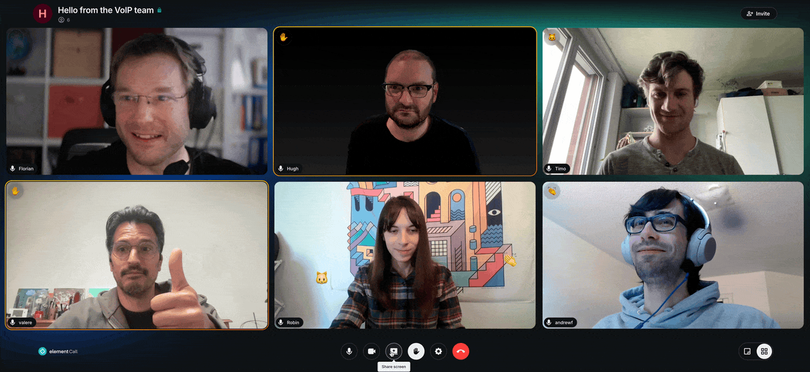
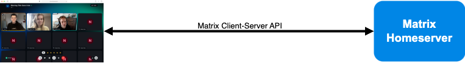
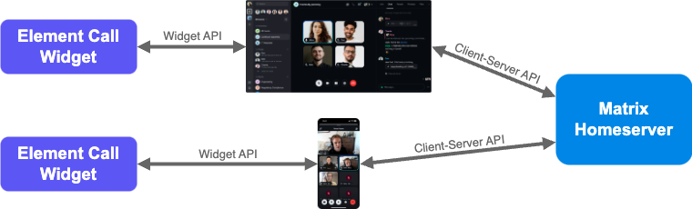
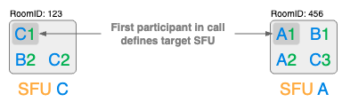

# Element Call

[](https://matrix.to/#/#webrtc:matrix.org)
[](https://localazy.com/p/element-call)
[](LICENSE-AGPL-3.0)

[🎬 Live Demo 🎬](https://call.element.io)

The world's first 🌐 decentralized and 🤝 federated video conferencing solution
powered by **the Matrix protocol**.

## 📌 Overview

**Element Call** is a native Matrix video conferencing application developed by
[Element](https://element.io/), designed for **secure**, **scalable**,
**privacy-respecting**, and **decentralized** video and voice calls over the
Matrix protocol. Built on **MatrixRTC**
([MSC4143](https://github.com/matrix-org/matrix-spec-proposals/pull/4143)), it
utilizes
**[MSC4195](https://github.com/hughns/matrix-spec-proposals/blob/hughns/matrixrtc-livekit/proposals/4195-matrixrtc-livekit.md)**
with **[LiveKit](https://livekit.io/)** as its backend.



You can find the latest development version continuously deployed to
[call.element.dev](https://call.element.dev/).

> [!NOTE]
> For prior version of the Element Call that relied solely on full-mesh logic,
> check [`full-mesh`](https://github.com/element-hq/element-call/tree/full-mesh)
> branch.

## ✨ Key Features

✅ **Decentralized & Federated** – No central authority; works across Matrix
homeservers.  
✅ **End-to-End Encrypted** – Secure and private calls.  
✅ **Standalone & Widget Mode** – Use as an independent app or embed in Matrix
clients.  
✅ **WebRTC-based** – No additional software required.  
✅ **Scalable with LiveKit** – Supports large meetings via SFU
([MSC4195: MatrixRTC using LiveKit backend](https://github.com/hughns/matrix-spec-proposals/blob/hughns/matrixrtc-livekit/proposals/4195-matrixrtc-livekit.md)).  
✅ **Raise Hand** – Participants can signal when they want to speak, helping to
organize the flow of the meeting.  
✅ **Emoji Reactions** – Users can react with emojis 👍️ 🎉 👏 🤘, adding
engagement and interactivity to the conversation.

## 🚀 Deployment & Packaging Options

Element Call is developed using the
[Matrix js-sdk](https://github.com/matrix-org/matrix-js-sdk) with Matroska mode.
This allows the app to run either as a Standalone App directly connected to a
homeserver with login interfaces or it can be used as a widget within a Matrix
client.

### 🖥️ Standalone Mode

<p align="center">
  
</p>

In Standalone mode, Element Call operates as an independent, full-featured video
conferencing web application, enabling users to join or host calls without
requiring a separate Matrix client.

### 📲 In-App Calling (Widget Mode in Messenger Apps)

When used as a widget 🧩, Element Call is solely responsible on the core calling
functionality (MatrixRTC). Authentication, event handling, and room state
updates (via the Client-Server API) are handled by the hosting client.
Communication between Element Call and the client is managed through the widget
API.

<p align="center">
  
</p>

Element Call can be embedded as a widget inside apps like
[**Element Web**](https://github.com/element-hq/element-web) or **Element X
([iOS](https://github.com/element-hq/element-x-ios),
[Android](https://github.com/element-hq/element-x-android))**, bringing
**MatrixRTC** capabilities to messenger apps for seamless decentralized video
and voice calls within Matrix rooms.

> [!IMPORTANT]
> Embedded packaging is recommended for Element Call in widget mode!

### 📦 Element Call Packaging

Element Call offers two packaging options: one for standalone or widget
deployment, and another for seamless widget-based integration into messenger
apps. Below is an overview of each option.

**Full Package** – Supports both **Standalone** and **Widget** mode. It is
hosted as a static web page and can be accessed via a URL when used as a widget.

<p align="center">
  
</p>

**Embedded Package** – Designed specifically for **Widget mode** only. It is
bundled with a messenger app for seamless integration and this is the
recommended method for embedding Element Call.

<p align="center">
  
</p>

For more details on the packages, see the
[Embedded vs. Standalone Guide](./docs/embedded-standalone.md).

## 🛠️ Self-Hosting

For operating and deploying Element Call on your own server, refer to the
[**Self-Hosting Guide**](./docs/self-hosting.md).

## 🧭 MatrixRTC Backend Discovery and Selection

For proper Element Call operation each site deployment needs a MatrixRTC backend
setup as outlined in the [Self-Hosting](#self-hosting). A typical federated site
deployment for three different sites A, B and C is depicted below.

<p align="center">
  
</p>

### Backend Discovery

MatrixRTC backend (according to
[MSC4143](https://github.com/matrix-org/matrix-spec-proposals/pull/4143)) is
announced by the Matrix site's `.well-known/matrix/client` file and discovered
via the `org.matrix.msc4143.rtc_foci` key, e.g.:

```json
"org.matrix.msc4143.rtc_foci": [
    {
        "type": "livekit",
        "livekit_service_url": "https://matrix-rtc.example.com/livekit/jwt"
    },
]
```

where the format for MatrixRTC using LiveKit backend is defined in
[MSC4195](https://github.com/hughns/matrix-spec-proposals/blob/hughns/matrixrtc-livekit/proposals/4195-matrixrtc-livekit.md).
In the example above Matrix clients do discover a focus of type `livekit` which
points them to a [MatrixRTC Authorization Service](https://github.com/element-hq/lk-jwt-service)
via `livekit_service_url`.

### Backend Selection

- Each call participant proposes their discovered MatrixRTC backend from
  `org.matrix.msc4143.rtc_foci` in their `org.matrix.msc3401.call.member` state event.
- For **LiveKit** MatrixRTC backend
  ([MSC4195](https://github.com/hughns/matrix-spec-proposals/blob/hughns/matrixrtc-livekit/proposals/4195-matrixrtc-livekit.md)),
  the **first participant who joined the call** defines via the `foci_preferred`
  key in their `org.matrix.msc3401.call.member` which actual MatrixRTC backend
  will be used for this call.
- During the actual call join flow, the **[MatrixRTC Authorization Service](https://github.com/element-hq/lk-jwt-service)**
  provides the client with the **LiveKit SFU WebSocket URL** and an
  **access JWT token** in order to exchange media via WebRTC.

The example below illustrates how backend selection works across **Matrix
federation**, using the setup from sites A, B, and C. It demonstrates backend
selection for **Matrix rooms 123 and 456**, which include users from different
homeservers.

<p align="center">
  
</p>

## 🌍 Translation

If you'd like to help translate Element Call, head over to
[Localazy](https://localazy.com/p/element-call). You're also encouraged to join
the [Element Translators](https://matrix.to/#/#translators:element.io) space to
discuss and coordinate translation efforts.

## 🛠️ Development

### Frontend

To get started clone and set up this project:

```sh
git clone https://github.com/element-hq/element-call.git
cd element-call
corepack enable
yarn
```

To use it, create a local config by, e.g.,
`cp ./config/config.devenv.json ./public/config.json` and adapt it if necessary.
The `config.devenv.json` config should work with the backend development
environment as outlined in the next section out of box.

You're now ready to launch the development server:

```sh
yarn dev
```

See also:

- [Developing with linked packages](./linking.md)

### Backend

A docker compose file `dev-backend-docker-compose.yml` is provided to start the
whole stack of components which is required for a local development environment
including federation:

- Minimum Synapse Setup (servernameis: `synapse.m.localhost`, `synapse.othersite.m.localhost`)
- MatrixRTC Authorization Service (Note requires Federation API and hence a TLS reverse proxy)
- Minimum LiveKit SFU setup using dev defaults for config
- Minimum `localhost` Certificate Authority (CA) for Transport Layer Security (TLS)
  - Hostnames: `m.localhost`, `*.m.localhost`, `*.othersite.m.localhost`
  - Add [./backend/dev_tls_local-ca.crt](./backend/dev_tls_local-ca.crt) to your web browsers trusted
    certificates
- Minimum TLS reverse proxy for
  - Synapse homeserver: `synapse.m.localhost` and `synapse.othersite.m.localhost`
  - MatrixRTC backend: `matrix-rtc.m.localhost` and `matrix-rtc.othersite.m.localhost`
  - Local Element Call development `call.m.localhost` via `yarn dev --host `
  - Element Web `app.m.localhost` and `app.othersite.m.localhost`
  - Note certificates will expire on Thr, 20 September 2035 14:27:35 CEST

These use a test 'secret' published in this repository, so this must be used
only for local development and **_never be exposed to the public Internet._**

Run backend components:

```sh
yarn backend
# or  for podman-compose
# podman-compose -f dev-backend-docker-compose.yml up
```

> [!NOTE]
> To ensure your local development frontend functions properly, you’ll need to
> add certificate exceptions in your browser for `https://localhost:3000`,
> `https://matrix-rtc.m.localhost/livekit/jwt/healthz` and
> `https://synapse.m.localhost/.well-known/matrix/client`. This can be either
> done by adding the minimum localhost CA
> ([./backend/dev_tls_local-ca.crt](./backend/dev_tls_local-ca.crt)) to your web
> browsers trusted certificates or by simply copying and pasting each URL into
> your browser’s address bar and follow the prompts to add the exception.

### Playwright tests

Our Playwright tests run automatically as part of our CI along with our other
tests, on every pull request.

You may need to follow instructions to set up your development environment for
running Playwright by following
<https://playwright.dev/docs/browsers#install-browsers> and
<https://playwright.dev/docs/browsers#install-system-dependencies>.

However the Playwright tests are run, an element-call instance must be running
on https://localhost:3000 (this is configured in `playwright.config.ts`) - this
is what will be tested.

The local backend environment should be running for the test to work:
`yarn backend`

There are a few different ways to run the tests yourself. The simplest is to
run:

```shell
yarn run test:playwright
```

This will run the Playwright tests once, non-interactively.

There is a more user-friendly way to run the tests in interactive mode:

```shell
yarn run test:playwright:open
```

The easiest way to develop new test is to use the codegen feature of Playwright:

```shell
npx playwright codegen
```

This will record your action and write the test code for you. Use the tool bar
to test visibility, text content and clicking.

##### Investigate a failed test from the CI

In the failed action page, click on the failed job, then scroll down to the
`upload-artifact` step. You will find a link to download the zip report, as per:

```
Artifact playwright-report has been successfully uploaded! Final size is 1360358 bytes. Artifact ID is 2746265841
Artifact download URL: https://github.com/element-hq/element-call/actions/runs/13837660687/artifacts/2746265841
```

Unzip the report then use this command to open the report in your browser:

```shell
npx playwright show-report ~/Downloads/playwright-report/
```

Under the failed test there is a small icon looking like "3 columns" (next to
the test name file name), click on it to see the live screenshots/console
output.

### Test Coverage

</img>

### Add a new translation key

To add a new translation key you can do these steps:

1. Add the new key entry to the code where the new key is used:
   `t("some_new_key")`
1. Run `yarn i18n` to extract the new key and update the translation files. This
   will add a skeleton entry to the `locales/en/app.json` file:

   ```jsonc
   {
       ...
       "some_new_key": "",
       ...
   }
   ```

1. Update the skeleton entry in the `locales/en/app.json` file with the English
   translation:

   ```jsonc
   {
       ...
       "some_new_key": "Some new key",
       ...
   }
   ```

## 📖 Documentation

Usage and other technical details about the project can be found here:

[**Docs**](./docs/README.md)

## 📝 Copyright & License

Copyright 2021-2025 New Vector Ltd

This software is dual-licensed by New Vector Ltd (Element). It can be used
either:

(1) for free under the terms of the GNU Affero General Public License (as
published by the Free Software Foundation, either version 3 of the License, or
(at your option) any later version); OR

(2) under the terms of a paid-for Element Commercial License agreement between
you and Element (the terms of which may vary depending on what you and Element
have agreed to). Unless required by applicable law or agreed to in writing,
software distributed under the Licenses is distributed on an "AS IS" BASIS,
WITHOUT WARRANTIES OR CONDITIONS OF ANY KIND, either express or implied. See the
Licenses for the specific language governing permissions and limitations under
the Licenses.
