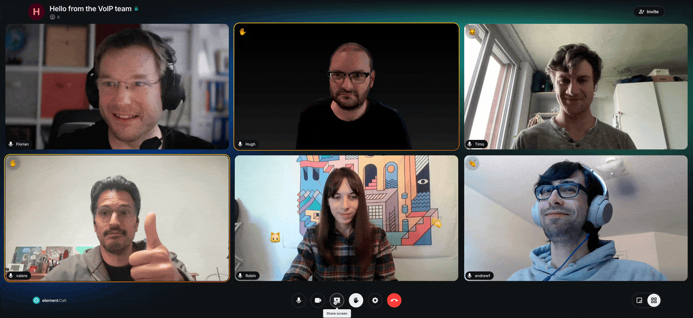
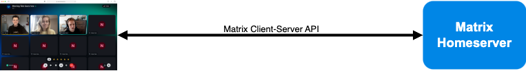
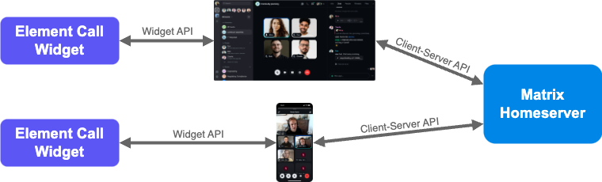
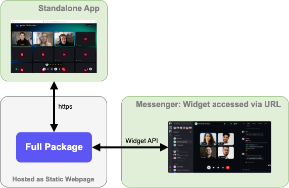
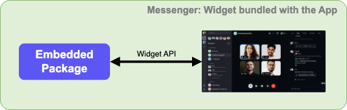
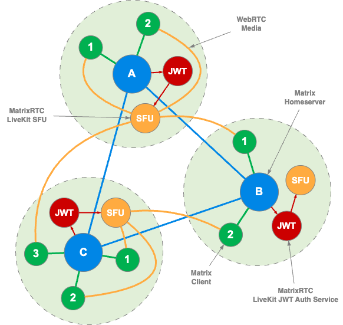
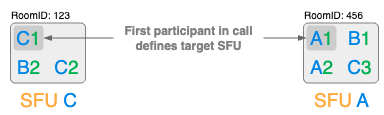

# Nangman Infra Meet

Community-maintained fork of [element-hq/element-call](https://github.com/element-hq/element-call) for the Nangman Infra team.

Source code for this deployment is published at [nangman-infra/nangman-infra-meet](https://github.com/nangman-infra/nangman-infra-meet).

> [!NOTE]
> This repository is based on Element Call. Upstream copyrights and license
> terms remain in effect. See [LICENSE-AGPL-3.0](./LICENSE-AGPL-3.0) and
> [LICENSE-COMMERCIAL](./LICENSE-COMMERCIAL) for details.

[](https://matrix.to/#/#webrtc:matrix.org)
[](https://localazy.com/p/element-call)
[](LICENSE-AGPL-3.0)

[🎬 Live Demo 🎬](https://call.element.io)

## Upstream Project

The upstream project name is **Element Call**. The rest of this document keeps
that name when describing the original architecture, packaging, and
documentation.

The world's first 🌐 decentralized and 🤝 federated video conferencing solution
powered by **the Matrix protocol**.

## 📌 Overview

**Element Call** is a native Matrix video conferencing application developed by
[Element](https://element.io/), designed for **secure**, **scalable**,
**privacy-respecting**, and **decentralized** video and voice calls over the
Matrix protocol. Built on **MatrixRTC**
([MSC4143](https://github.com/matrix-org/matrix-spec-proposals/pull/4143)), it
utilizes
**[MSC4195](https://github.com/hughns/matrix-spec-proposals/blob/hughns/matrixrtc-livekit/proposals/4195-matrixrtc-livekit.md)**
with **[LiveKit](https://livekit.io/)** as its backend.



You can find the latest development version continuously deployed to
[call.element.dev](https://call.element.dev/).

> [!NOTE]
> For prior version of the Element Call that relied solely on full-mesh logic,
> check [`full-mesh`](https://github.com/element-hq/element-call/tree/full-mesh)
> branch.

## ✨ Key Features

✅ **Decentralized & Federated** – No central authority; works across Matrix
homeservers.  
✅ **End-to-End Encrypted** – Secure and private calls.  
✅ **Standalone & Widget Mode** – Use as an independent app or embed in Matrix
clients.  
✅ **WebRTC-based** – No additional software required.  
✅ **Scalable with LiveKit** – Supports large meetings via SFU
([MSC4195: MatrixRTC using LiveKit backend](https://github.com/hughns/matrix-spec-proposals/blob/hughns/matrixrtc-livekit/proposals/4195-matrixrtc-livekit.md)).  
✅ **Raise Hand** – Participants can signal when they want to speak, helping to
organize the flow of the meeting.  
✅ **Emoji Reactions** – Users can react with emojis 👍️ 🎉 👏 🤘, adding
engagement and interactivity to the conversation.

## 🚀 Deployment & Packaging Options

Element Call is developed using the
[Matrix js-sdk](https://github.com/matrix-org/matrix-js-sdk) with Matroska mode.
This allows the app to run either as a Standalone App directly connected to a
homeserver with login interfaces or it can be used as a widget within a Matrix
client.

### 🖥️ Standalone Mode

<p align="center">
  
</p>

In Standalone mode, Element Call operates as an independent, full-featured video
conferencing web application, enabling users to join or host calls without
requiring a separate Matrix client.

### 📲 In-App Calling (Widget Mode in Messenger Apps)

When used as a widget 🧩, Element Call is solely responsible on the core calling
functionality (MatrixRTC). Authentication, event handling, and room state
updates (via the Client-Server API) are handled by the hosting client.
Communication between Element Call and the client is managed through the widget
API.

<p align="center">
  
</p>

Element Call can be embedded as a widget inside apps like
[**Element Web**](https://github.com/element-hq/element-web) or **Element X
([iOS](https://github.com/element-hq/element-x-ios),
[Android](https://github.com/element-hq/element-x-android))**, bringing
**MatrixRTC** capabilities to messenger apps for seamless decentralized video
and voice calls within Matrix rooms.

> [!IMPORTANT]
> Embedded packaging is recommended for Element Call in widget mode!

### 📦 Element Call Packaging

Element Call offers two packaging options: one for standalone or widget
deployment, and another for seamless widget-based integration into messenger
apps. Below is an overview of each option.

**Full Package** – Supports both **Standalone** and **Widget** mode. It is
hosted as a static web page and can be accessed via a URL when used as a widget.

<p align="center">
  
</p>

**Embedded Package** – Designed specifically for **Widget mode** only. It is
bundled with a messenger app for seamless integration and this is the
recommended method for embedding Element Call.

<p align="center">
  
</p>

For more details on the packages, see the
[Embedded vs. Standalone Guide](./docs/embedded-standalone.md).

## 🛠️ Self-Hosting

For operating and deploying Element Call on your own server, refer to the
[**Self-Hosting Guide**](./docs/self-hosting.md).

## 🧭 MatrixRTC Backend Discovery and Selection

For proper Element Call operation each site deployment needs a MatrixRTC backend
setup as outlined in the [Self-Hosting](#self-hosting). A typical federated site
deployment for three different sites A, B and C is depicted below.

<p align="center">
  
</p>

### Backend Discovery

MatrixRTC backend (according to
[MSC4143](https://github.com/matrix-org/matrix-spec-proposals/pull/4143)) is
announced by the Matrix site's `.well-known/matrix/client` file and discovered
via the `org.matrix.msc4143.rtc_foci` key, e.g.:

```json
"org.matrix.msc4143.rtc_foci": [
    {
        "type": "livekit",
        "livekit_service_url": "https://matrix-rtc.example.com/livekit/jwt"
    },
]
```

where the format for MatrixRTC using LiveKit backend is defined in
[MSC4195](https://github.com/hughns/matrix-spec-proposals/blob/hughns/matrixrtc-livekit/proposals/4195-matrixrtc-livekit.md).
In the example above Matrix clients do discover a focus of type `livekit` which
points them to a [MatrixRTC Authorization Service](https://github.com/element-hq/lk-jwt-service)
via `livekit_service_url`.

### Backend Selection

- Each call participant proposes their discovered MatrixRTC backend from
  `org.matrix.msc4143.rtc_foci` in their `org.matrix.msc3401.call.member` state event.
- For **LiveKit** MatrixRTC backend
  ([MSC4195](https://github.com/hughns/matrix-spec-proposals/blob/hughns/matrixrtc-livekit/proposals/4195-matrixrtc-livekit.md)),
  the **first participant who joined the call** defines via the `foci_preferred`
  key in their `org.matrix.msc3401.call.member` which actual MatrixRTC backend
  will be used for this call.
- During the actual call join flow, the **[MatrixRTC Authorization Service](https://github.com/element-hq/lk-jwt-service)**
  provides the client with the **LiveKit SFU WebSocket URL** and an
  **access JWT token** in order to exchange media via WebRTC.

The example below illustrates how backend selection works across **Matrix
federation**, using the setup from sites A, B, and C. It demonstrates backend
selection for **Matrix rooms 123 and 456**, which include users from different
homeservers.

<p align="center">
  
</p>

## 🌍 Translation

If you'd like to help translate Element Call, head over to
[Localazy](https://localazy.com/p/element-call). You're also encouraged to join
the [Element Translators](https://matrix.to/#/#translators:element.io) space to
discuss and coordinate translation efforts.

## 🛠️ Development

### Frontend

To get started clone and set up this project:

```sh
git clone https://github.com/element-hq/element-call.git
cd element-call
corepack enable
yarn
```

To use it, create a local config by, e.g.,
`cp ./config/config.devenv.json ./public/config.json` and adapt it if necessary.
The `config.devenv.json` config should work with the backend development
environment as outlined in the next section out of box.

You're now ready to launch the development server:

```sh
yarn dev
```

See also:

- [Developing with linked packages](./linking.md)

### Docker Deployment

This fork uses a single deployment container that builds the app and serves it
through Nginx. Runtime configuration is supplied through `.env.deploy`, which
is rendered into `/config.json` when the container starts.

```sh
cp .env.deploy.example .env.deploy
# edit .env.deploy
docker compose up --build -d
```

The service is exposed on port `8082` by default.

### Playwright tests

Playwright can still be run manually against a running app instance. The
simplest command is:

```shell
yarn run test:playwright
```

This will run the Playwright tests once, non-interactively.

There is a more user-friendly way to run the tests in interactive mode:

```shell
yarn run test:playwright:open
```

The easiest way to develop new test is to use the codegen feature of Playwright:

```shell
npx playwright codegen
```

This will record your action and write the test code for you. Use the tool bar
to test visibility, text content and clicking.

### Add a new translation key

To add a new translation key you can do these steps:

1. Add the new key entry to the code where the new key is used:
   `t("some_new_key")`
1. Run `yarn i18n` to extract the new key and update the translation files. This
   will add a skeleton entry to the `locales/en/app.json` file:

   ```jsonc
   {
       ...
       "some_new_key": "",
       ...
   }
   ```

1. Update the skeleton entry in the `locales/en/app.json` file with the English
   translation:

   ```jsonc
   {
       ...
       "some_new_key": "Some new key",
       ...
   }
   ```

## 📖 Documentation

Usage and other technical details about the project can be found here:

[**Docs**](./docs/README.md)

## 📝 Copyright & License

Copyright 2021-2025 New Vector Ltd

This software is dual-licensed by New Vector Ltd (Element). It can be used
either:

(1) for free under the terms of the GNU Affero General Public License (as
published by the Free Software Foundation, either version 3 of the License, or
(at your option) any later version); OR

(2) under the terms of a paid-for Element Commercial License agreement between
you and Element (the terms of which may vary depending on what you and Element
have agreed to). Unless required by applicable law or agreed to in writing,
software distributed under the Licenses is distributed on an "AS IS" BASIS,
WITHOUT WARRANTIES OR CONDITIONS OF ANY KIND, either express or implied. See the
Licenses for the specific language governing permissions and limitations under
the Licenses.
