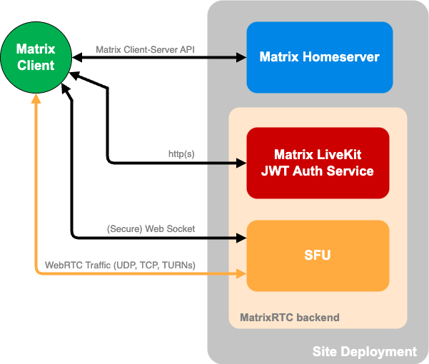

# Self-Hosting Element Call

## Prerequisites

> [!IMPORTANT]  
> This section covers the requirements for deploying a **Matrix site**
> compatible with MatrixRTC, the foundation of Element Call. These requirements
> apply to both Standalone as well as Widget mode operation of Element Call.

### A Matrix Homeserver

The following [MSCs](https://github.com/matrix-org/matrix-spec-proposals) are
required for Element Call to work properly:

- **[MSC3266](https://github.com/deepbluev7/matrix-doc/blob/room-summaries/proposals/3266-room-summary.md):
  Room Summary API**: In Standalone mode Element Call is able to join rooms
  over federation using knocking. In this context MSC3266 is required as it
  allows to request a room summary of rooms you are not joined. The summary
  contains the room join rules. We need that information to decide if the user
  gets prompted with the option to knock ("Request to join call"), a "cannot
  join error" or "the join view".

- **[MSC4140](https://github.com/matrix-org/matrix-spec-proposals/blob/toger5/expiring-events-keep-alive/proposals/4140-delayed-events-futures.md)
  Delayed Events**: Delayed events are required for proper call participation
  signalling. If disabled it is very likely that you end up with stuck calls in
  Matrix rooms.

- **[MSC4222](https://github.com/matrix-org/matrix-spec-proposals/blob/erikj/sync_v2_state_after/proposals/4222-sync-v2-state-after.md)
  Adding `state_after` to sync v2**: Allow clients to opt-in to a change of the
  sync v2 API that allows them to correctly track the state of the room. This is
  required by Element Call to track room state reliably.

If you're using [Synapse](https://github.com/element-hq/synapse/) as your homeserver, you'll need
to additionally add the following config items to `homeserver.yaml` to comply with Element Call:

```yaml
experimental_features:
  # MSC3266: Room summary API. Used for knocking over federation
  msc3266_enabled: true
  # MSC4222 needed for syncv2 state_after. This allow clients to
  # correctly track the state of the room.
  msc4222_enabled: true

# The maximum allowed duration by which sent events can be delayed, as
# per MSC4140.
max_event_delay_duration: 24h

rc_message:
  # This needs to match at least e2ee key sharing frequency plus a bit of headroom
  # Note key sharing events are bursty
  per_second: 0.5
  burst_count: 30
  # This needs to match at least the heart-beat frequency plus a bit of headroom
  # Currently the heart-beat is every 5 seconds which translates into a rate of 0.2s
rc_delayed_event_mgmt:
  per_second: 1
  burst_count: 20
```

### MatrixRTC Backend

In order to **guarantee smooth operation** of Element Call MatrixRTC backend is
required for each site deployment.



As depicted above, Element Call requires a
[Livekit SFU](https://github.com/livekit/livekit) alongside a
[Matrix Livekit JWT auth service](https://github.com/element-hq/lk-jwt-service)
to implement
[MSC4195: MatrixRTC using LiveKit backend](https://github.com/hughns/matrix-spec-proposals/blob/hughns/matrixrtc-livekit/proposals/4195-matrixrtc-livekit.md).

> [!IMPORTANT]
> As defined in
> [MSC4143](https://github.com/matrix-org/matrix-spec-proposals/pull/4143)
> MatrixRTC backend must be announced to the client via your **homeserver's
> `.well-known/matrix/client`**. The configuration is a list of Foci configs:

```json
"org.matrix.msc4143.rtc_foci": [
    {
        "type": "livekit",
        "livekit_service_url": "https://someurl.com"
    },
     {
        "type": "livekit",
        "livekit_service_url": "https://livekit2.com"
    },
    {
        "type": "another_foci",
        "props_for_another_foci": "val"
    },
]
```

## Building Element Call

> [!NOTE]  
> This step is only required if you want to deploy Element Call in Standalone
> mode.

Until prebuilt tarballs are available, you'll need to build Element Call from
source. First, clone and install the package:

```sh
git clone https://github.com/element-hq/element-call.git
cd element-call
yarn
yarn build
```

If all went well, you can now find the build output under `dist` as a series of
static files. These can be hosted using any web server that can be configured
with custom routes (see below).

You also need to add a configuration file which goes in `public/config.json` -
you can use the sample as a starting point:

```sh
cp config/config.sample.json public/config.json
# edit public/config.json
```

The sample needs editing to contain the homeserver that you are using.

Because Element Call uses client-side routing, your server must be able to route
any requests to non-existing paths back to `/index.html`. For example, in Nginx
you can achieve this with the `try_files` directive:

```jsonc
server {
    ...
    location / {
        ...
        try_files $uri /$uri /index.html;
    }
}
```

## Configuration

There are currently two different config files. `.env` holds variables that are
used at build time, while `public/config.json` holds variables that are used at
runtime. Documentation and default values for `public/config.json` can be found
in [ConfigOptions.ts](src/config/ConfigOptions.ts).

> [!CAUTION]
> Please note configuring MatrixRTC backend via `config.json` of
> Element Call is only available for developing and debug purposes. Relying on
> it might break Element Call going forward!

## A Note on Standalone Mode of Element Call

Element Call in Standalone mode requires a homeserver with registration enabled
without any 3pid or token requirements, if you want it to be used by
unregistered users. Furthermore, it is not recommended to use it with an
existing homeserver where user accounts have joined normal rooms, as it may not
be able to handle those yet and it may behave unreliably.

Therefore, to use a self-hosted homeserver, this is recommended to be a new
server where any user account created has not joined any normal rooms anywhere
in the Matrix federated network. The homeserver used can be setup to disable
federation, so as to prevent spam registrations (if you keep registrations open)
and to ensure Element Call continues to work in case any user decides to log in
to their Element Call account using the standard Element app and joins normal
rooms that Element Call cannot handle.
